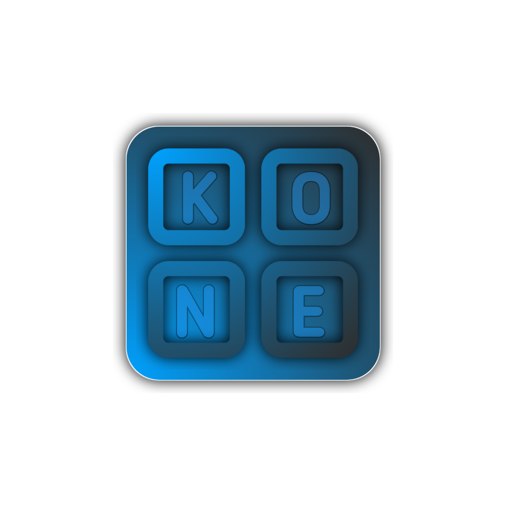

# 🚀 Keanone Project

  
   
  
<em>Современная платформа для цифровой коммерции</em>

  
  
  
  
  

## 📋 Обзор проекта

Keanone Project — это современная платформа электронной коммерции, созданная для безопасных сделок в сфере цифровых товаров и услуг. Платформа объединяет продавцов и покупателей в едином пространстве с интуитивно понятным интерфейсом, продвинутыми функциями для управления магазинами и надежной системой администрирования.

### ✨ Основные возможности

- **Темная тема** — элегантный темный интерфейс с тщательно подобранной цветовой схемой
- **Адаптивный дизайн** — полная поддержка мобильных и десктопных устройств
- **Минималистичные анимации** — плавные переходы и интерактивные элементы
- **Многоуровневая система доступа** — различные роли от пользователя до владельца платформы
- **Многоязычность** — поддержка нескольких языков интерфейса

## 🛠️ Технологический стек

### Основные языки программирования

- **[TypeScript](https://www.typescriptlang.org/)** — строго типизированное надмножество JavaScript
- **[JavaScript](https://developer.mozilla.org/en-US/docs/Web/JavaScript)** — используется в некоторых вспомогательных модулях

### Фронтенд

- **[React.js](https://reactjs.org/)** — библиотека для создания пользовательских интерфейсов
- **[Tailwind CSS](https://tailwindcss.com/)** — утилитарный CSS-фреймворк
- **[Wouter](https://github.com/molefrog/wouter)** — легковесная библиотека маршрутизации
- **[Framer Motion](https://www.framer.com/motion/)** — библиотека для анимаций
- **[TanStack Query](https://tanstack.com/query/latest)** — управление состоянием и кэширование
- **[Zod](https://zod.dev/)** — валидация данных на основе схем
- **[React Hook Form](https://react-hook-form.com/)** — управление формами
- **[Lucide React](https://lucide.dev/)** — библиотека иконок

### Бэкенд

- **[Node.js](https://nodejs.org/)** — среда выполнения JavaScript
- **[Express](https://expressjs.com/)** — веб-фреймворк для создания API
- **[WebSocket](https://developer.mozilla.org/en-US/docs/Web/API/WebSockets_API)** — коммуникация в реальном времени
- **[PostgreSQL](https://www.postgresql.org/)** — реляционная база данных

### Сборка и разработка

- **[Vite](https://vitejs.dev/)** — быстрый инструмент для сборки и разработки
- **[npm](https://www.npmjs.com/)** — менеджер пакетов
- **[tsx](https://github.com/esbuild-kit/tsx)** — утилита для запуска TypeScript кода

## 🎨 Особенности дизайна и анимации

- **CSS-переменные** — для гибкой темизации и адаптации
- **Keyframe-анимации** — для создания плавных переходов и эффектов
- **Минималистичный UI** — фокус на содержание и удобство использования
- **Продуманная типография** — для лучшей читабельности и визуальной иерархии

Проект построен на микросервисной архитектуре с четким разделением обязанностей:

- **Клиент** — SPA на React с архитектурой на основе компонентов
- **API сервер** — RESTful API с использованием Node.js и Express
- **Реальное время** — WebSocket для уведомлений и чатов

## 🔍 Особенности системы ролей

| Роль | Описание |
|------|----------|
| **USER** | Базовый пользователь платформы |
| **SHOP_STAFF** | Сотрудник магазина с ограниченными правами |
| **SHOP_MAIN** | Управляющий магазином |
| **SHOP_OWNER** | Владелец магазина |
| **MODERATOR** | Модератор платформы |
| **ADMIN** | Администратор платформы |
| **HEADADMIN** | Главный администратор |
| **SECURITY** | Отдел безопасности с расширенными правами |
| **OWNER** | Владелец платформы с полным доступом |

## Версии проекта

| Версия | Дата | Время | 
|------|----------|----------|
| **0.1.0** | 09.05.2025 | 23:00:00 |

## 🌐 Связь с нами

- **[Telegram Bot](https://t.me/KeanoneSupportRobot)** — Техническая поддержка
- **Email**: Позже.
- **Время работы**: 10:00 - 23:30

## 👤 Команда проекта

- [интернет псих.](https://k-connect.ru/profile/zxcursed) — Main Developer/Owner
- [Ян Брагин](https://k-connect.ru/profile/qsoul) - Second Developer/Owner

## 📝 Лицензия

Этот проект лицензирован под [MIT License](LICENSE).

---

  
© 2025 Keanone Project. Все права защищены.

  
Сделано с ❤️ в России

 
